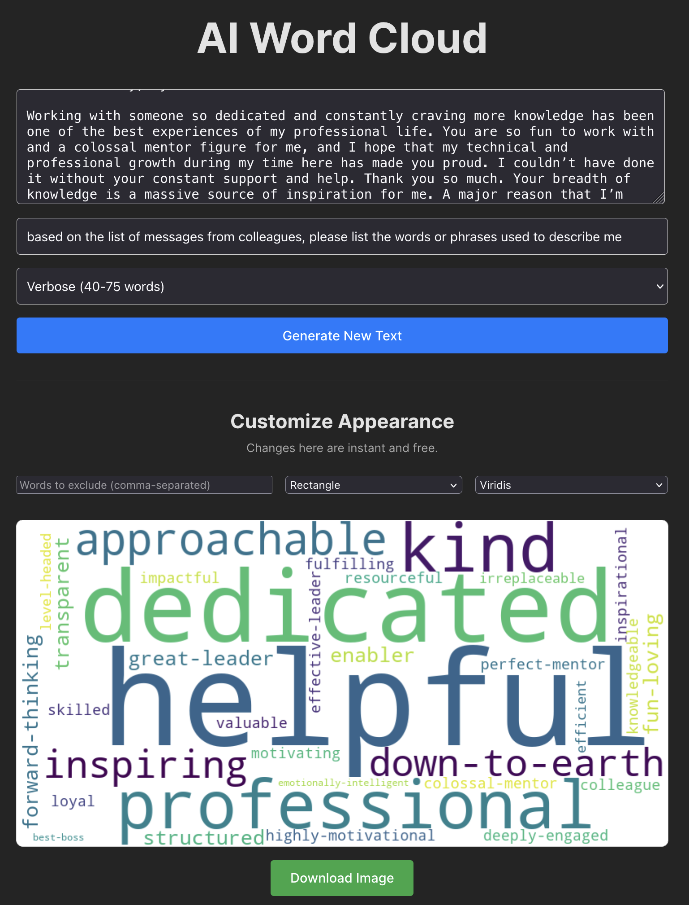

# AI Word Cloud

A simple, powerful web application for generating beautiful, customized word clouds from any text using Google's Gemini API.



## Features

-   **AI-Powered Text Analysis:** Uses Google's Gemini to extract keywords based on your instructions (e.g., "all nouns," "adjectives describing the protagonist").
-   **Instant Customization:** After generating the text, you can instantly customize the appearance of the word cloud without new API calls.
-   **Customizable Appearance:**
    -   **Shapes:** Render as a classic rectangle or a modern sphere.
    -   **Color Palettes:** Choose from multiple themes like Ocean, Sunset, and Monochrome.
    -   **Word Exclusion:** Easily filter out common or unwanted words.
-   **Downloadable Images:** Save your final creation as a high-quality PNG.
-   **Single Server:** Both the React frontend and FastAPI backend are run from a single process for simple setup.

## How to Run

### 1. Install Frontend Dependencies
From the project root, navigate to the `frontend` directory to install dependencies and build the production files.
```bash
cd frontend
npm install
npm run build
```

### 2. Set Up Backend Environment
Navigate back to the project root and then into the `backend` directory.

**Create the virtual environment:**
```bash
cd ../backend
python3 -m venv .venv
```

**Activate the virtual environment:**
-   On **macOS / Linux**:
    ```bash
    source .venv/bin/activate
    ```
-   On **Windows**:
    ```bash
    .\.venv\Scripts\activate
    ```

**Install Python packages:**
*(Ensure your virtual environment is active before running)*
```bash
pip install -r ../requirements.txt
```

### 3. Start the Server
From the `backend` directory (with your virtual environment activated), start the FastAPI server:
```bash
uvicorn main:app --reload
```

### 4. Use the App
-   Navigate to `http://127.0.0.1:8000` in your browser.
-   Enter your Google AI Studio (Gemini) API key in the designated input field. The key is sent with each request and is not stored on the server.
-   Enter your source text and instructions, and click "Generate New Text."
-   Use the customization panel to adjust the appearance instantly.
-   Download your finished word cloud!
